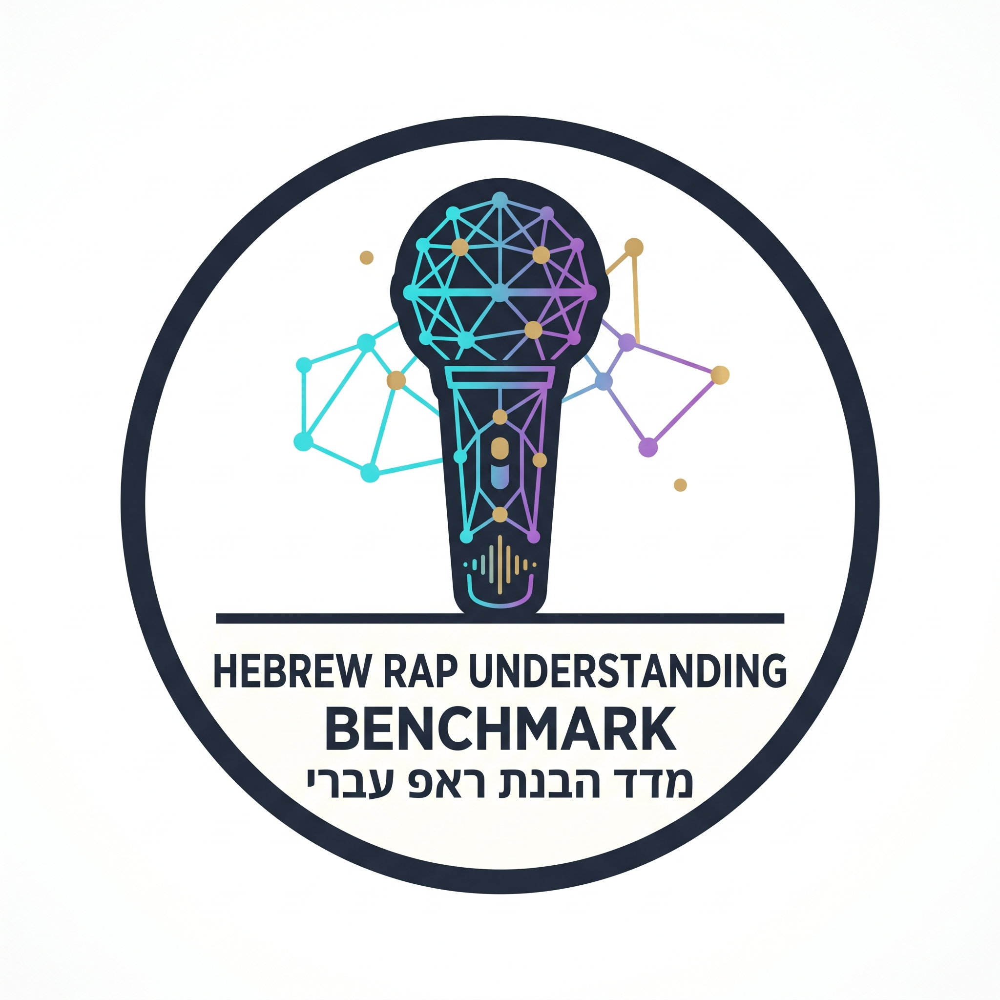

# 🎤 Hebrew Rap Slang Understanding Benchmark

<p align="center">
  
</p>

<p align="center">
  <a href="https://github.com/razdiamond/hebrew-rap-slang-benchmark/blob/main/pipeline/README.md"></a>
  <a href="https://wayground.com/activity/admin/quiz/6ab6982fa0eb58f33a81a32e"></a>
  <a href="https://post.runi.ac.il/"></a>
  <a href="https://python.org"></a>
</p>

---

## 📌 TL;DR
While state-of-the-art (SOTA) Large Language Models (LLMs) and Hebrew-specialized models achieve strong performance on standard, formal, or literal Hebrew text, they frequently fail when processing deep cultural context, modern subcultural slang, wordplay, and figurative idioms. 

**Hebrew Rap Slang Understanding Benchmark** is an empirical evaluation framework containing **123 hand-curated gold questions** extracted from Israeli hip-hop and rap lyrics paired with crowdsourced Ground Truth (GT) annotations from Genius. Models are evaluated across two complementary paradigms:
1. **Multiple-Choice Discrimination (Closed-Form):** Selecting the correct cultural meaning out of 4 options (Accuracy & Macro F1).
2. **Open-Ended Explanation:** Generating free-text explanations, evaluated using:
   - **Dense Semantic Embedding Similarity** (`gemini-embedding-2-preview` cosine similarity).
   - **LLM-as-a-Judge Factual Accuracy** (`gemini-3.8-flash` grading on a 0–100 rubric).

---

## 🏆 Current Leaderboard
You can view the up-to-date benchmark standings and detailed multi-metric comparisons across 20+ models in [**`pipeline/README.md`**](pipeline/README.md).

The final grade uses a balanced composite weight:
$$\text{Final Grade} = 0.50 \times \text{LLM Judge Score} + 0.30 \times \text{MC Accuracy} + 0.20 \times \text{Cosine Similarity}$$

| Rank | Model | Creator | MC Accuracy (%) | Cosine Sim (%) | Judge Score (0-100) | Final Grade |
| :---: | :--- | :---: | :---: | :---: | :---: | :---: |
| **#1** | `gemini-3.1-pro-preview` | Google | 95.12 | 75.88 | 79.27 | **83.35** |
| **#2** | `gemini-3.8-flash` | Google | 94.31 | 75.97 | 76.22 | **81.60** |
| **#3** | `gemini-3-flash-preview` | Google | 92.68 | 76.28 | 71.95 | **79.04** |
| **#4** | `gpt-5` | OpenAI | 79.67 | 78.82 | 68.70 | **74.02** |
| **#5** | `muse-spark-1.3-contributor` | Meta | 86.99 | 78.07 | 62.20 | **72.81** |

---

## ⚠️ Content Warning & Observational Disclaimer
The benchmark dataset contains raw, uncensored lyrics sampled directly from Israeli hip-hop, rap, drill, and trap songs. Consequently, some lyrics contain **vulgar, politically incorrect, disturbing, or offensive themes**, as well as slang, pop-culture hyperbole, and intentional cringe/nonsense.

All text is included **purely for academic research and observational evaluation** of linguistic comprehension in natural, uncurated subcultural discourse.

---

## 🧪 Quick Start: Evaluating a New Model

Evaluating a new model on the benchmark is fast, fully automated, and idempotent.

> [!NOTE]
> You **do not** need to run `01_dataset_pipeline.ipynb`. That notebook was used strictly to harvest Genius lyrics, curate the raw annotations, and generate the gold benchmark file (`data/processed/05_gold_benchmark.json`). For evaluating models, you only use the scripts in `pipeline/`.

### 1. Installation & Environment Setup
Clone the repository and set up a Python 3.13 environment:
```bash
git clone https://github.com/razdiamond/hebrew-rap-slang-benchmark.git
cd hebrew-rap-slang-benchmark

python -m venv .venv
# On Windows (PowerShell):
.venv\Scripts\activate
# On Linux/macOS:
# source .venv/bin/activate

pip install -r requirements.txt
```

### 2. Configure Environment Variables
Create a `.env` file in the project root based on `.env.example`:
```env
GEMINI_API_KEY="your_gemini_api_key_here"
OPENROUTER_KEY="your_openrouter_api_key_here"
```

> [!IMPORTANT]
> **`GEMINI_API_KEY` is mandatory for all evaluation runs**, even if you are evaluating open-weights local models (via Ollama) or OpenAI models. The evaluation phase uses `gemini-embedding-2-preview` for dense semantic similarity and `gemini-3.8-flash` as an impartial judge.

### 3. Add Your Model to `pipeline/models_config.py`
Add your new model configuration entry to the `MODELS_CONFIG` list in `pipeline/models_config.py`:
```python
{
    "real_name": "your-provider/your-model-name",
    "clean_name": "your_model_clean_slug",
    "creator": "provider",
    "params_b": 7.0,  # Or None if undisclosed
    "release_date": "2026-09",
    "base_url": OPENROUTER_BASE_URL,  # Or OLLAMA_BASE_URL / GEMINI_BASE_URL
    "api_key": OPENROUTER_KEY,
}
```
* **No need to delete or comment out existing models!** The entire pipeline is cached atomically in `data/results/`. Previously evaluated models will be recognized instantly and skipped.

### 4. Run Model Inference
Execute the inference script to collect both Multiple-Choice and Open-Ended responses across all pending models:
```bash
python pipeline/02_run_inference.py
```

### 5. Run Benchmark Evaluation
Open and run the evaluation notebook:
```bash
jupyter lab pipeline/03_evaluate_benchmark.ipynb
```
Running this notebook will:
- Grade Multiple-Choice accuracy and Macro F1 score.
- Compute dense embedding cosine similarity against Ground Truth explanations.
- Run `gemini-3.8-flash` LLM-as-a-Judge qualitative scoring (0, 25, 50, 75, 100).
- Update the composite leaderboard and auto-export the new standings to `pipeline/README.md`.

### 💰 Evaluation Cost
Evaluating a new model across all 123 benchmark items costs approximately **~0.63 ILS (~$0.17 USD)** total, driven almost entirely by the `gemini-3.8-flash` LLM-as-a-Judge API calls during open-ended evaluation.

---

## 🧠 Human Benchmark Quiz
To evaluate human comprehension against LLMs, we exported a randomized 30-question subset of the gold benchmark to an interactive public quiz on Wayground:

👉 [**Take the 30-Question Hebrew Rap Slang Quiz on Wayground**](https://wayground.com/activity/admin/quiz/6ab6982fa0eb58f33a81a32e)

*(You can export your own custom subset of the benchmark to Wayground format using `python scripts/export_wayground.py`).*

---

## 📐 Benchmark Design & Architecture

```text
hebrew-rap-slang-benchmark/
├── assets/
│   └── logo.png                          # Repository logo
├── data/
│   ├── raw/                              # Scraped Genius song index & lyrics corpus
│   ├── processed/
│   │   ├── 05_gold_benchmark.json        # Frozen Gold Benchmark (123 items)
│   │   └── wayground_exports/            # Wayground human quiz Excel exports
│   ├── results/                          # Raw model inference outputs
│   │   ├── multichoice/                  # MC responses per model (.json)
│   │   └── open_ended/                   # Open-ended responses per model (.json)
│   └── evaluation/                       # Cached evaluation artifacts (.npz & .json)
├── pipeline/
│   ├── 01_dataset_pipeline.ipynb         # Data harvesting, curation & distractor synthesis
│   ├── 02_run_inference.py               # Batch inference engine (Ollama, Gemini, OpenRouter)
│   ├── 03_evaluate_benchmark.ipynb       # Evaluation metrics, charts, & leaderboard export
│   ├── models_config.py                  # Central model configuration & API endpoints
│   └── README.md                         # Auto-generated benchmark leaderboard
├── scripts/
│   └── export_wayground.py               # Export benchmark subset to Wayground quiz format
├── docs/                                 # Project report & presentation slides (Optional)
├── .env.example                          # Environment keys template
├── requirements.txt                      # Project dependencies
└── README.md                             # Project overview & quickstart
```

### Dataset Curation & Distractor Synthesis
1. **Harvesting & Flattening:** Scraped over 2,200 Israeli hip-hop/rap tracks and 6,700 crowdsourced annotations via the Genius API (`01_dataset_pipeline.ipynb`).
2. **Filtering & Human Curation:** Filtered out unreviewed/low-vote annotations, applied strict artist distribution caps (max 8 phrases per artist), and manually curated **123 gold benchmark items** across wordplay, external knowledge, and local idiomatic slang.
3. **Distractor Generation:** Used `gemini-3.1-pro-preview` to standardize ground-truth explanations and synthesize 3 plausible, non-trivial distractor options with matching grammatical length and professional tone per question.

---

## 📄 Course Deliverables & Media

* 📖 **Final Report:** `docs/report.pdf` *(Coming soon)*
* 📊 **Presentation Slides:** `docs/presentation.pdf` *(Coming soon)*
* 🎥 **Video Presentation (5 min):** [Watch Walkthrough on YouTube](https://youtube.com/placeholder) *(Coming soon)*

---

## 🎓 Academic Context & Attribution
This project was developed as the **Final Capstone Project** for the **Natural Language Processing (NLP)** course at **Reichman University (RUNI)**, Efi Arazi School of Computer Science (Spring Semester 2026).

---

## ✉️ Contact & Contributions
Have questions, suggestions, or want to add a new model to the benchmark leaderboard? Pull/merge requests and model additions are welcome!

* **Author:** Raz Diamond
* **Email:** [raz.diamond@post.runi.ac.il](mailto:raz.diamond@post.runi.ac.il)
* **Institution:** Reichman University (RUNI)
